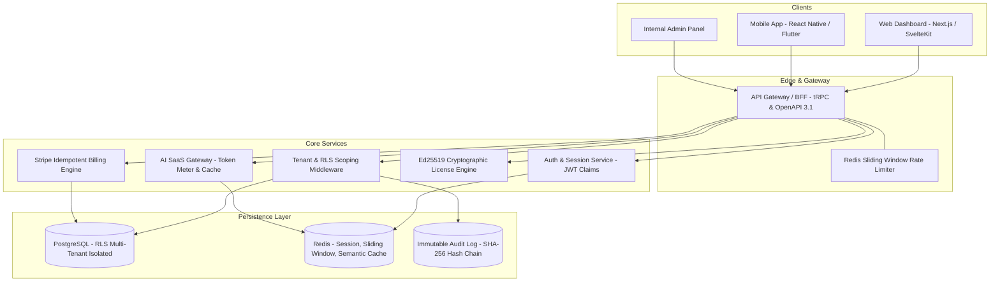

# SaaS Master Builder (SMB) 🚀

<div align="center">

```
   ____               ____    __  __           _            
  / ___|  __ _  __ _ / ___|  |  \/  | __ _ ___| |_ ___ _ __ 
  \___ \ / _` |/ _` |\___ \  | |\/| |/ _` / __| __/ _ \ '__|
   ___) | (_| | (_| | ___) | | |  | | (_| \__ \ ||  __/ |   
  |____/ \__,_|\__,_|____/   |_|  |_|\__,_|___/\__\___|_|   
                     B U I L D E R                          
```

### The Autonomous Engineering OS, Decision Framework & Production Breakthrough Toolkit for Unbreakable Multi-Tenant SaaS.

[](https://opensource.org/licenses/MIT)
[](https://nodejs.org/)
[](#the-anti-hallucination-evidence-gate)
[](#multi-tenant-isolation-rls)
[](#universal-ai-agent-os)

**Turn any AI Coding Agent into a 10x Principal SaaS Architect.**  
*Zero Hallucinations. Zero Cross-Tenant Leaks. Zero Payment Race Conditions. 100% Client Satisfaction.*

[Quickstart](#-quickstart-in-60-seconds) • [Architecture](#-system-architecture) • [Blueprints](#-production-blueprints) • [Anti-Hallucination Gate](#-the-anti-hallucination-evidence-gate) • [Client Handoff Kit](#-enterprise-client-handoff-kit)

---

</div>

## 💥 Why 99% of AI-Built SaaS Projects Crash in Production

When developers let AI coding agents build SaaS apps without guardrails, catastrophic failure modes consistently emerge:
1. **Cross-Tenant Data Leaks**: The AI relies on developers remembering `WHERE tenant_id = ?` in raw queries. One missed filter exposes Customer A's sensitive financial data to Customer B.
2. **Stripe Webhook Double-Charges**: The AI builds simple webhook routes without idempotency tables. Stripe's at-least-once delivery fires retries, causing double-charges, duplicated credits, and billing disputes.
3. **The "100% Done" Hallucination**: AI agents routinely declare tasks "tested and complete" when tests were never executed, APIs were hallucinated, and builds don't even compile.
4. **Fragile Licensing**: Offline or desktop apps hard-lock the moment a user's Wi-Fi drops for 10 seconds, triggering wave after wave of angry support tickets.
5. **Client Handoff Nightmares**: Freelancers and agencies hand over a messy repo with no documentation, no ADRs, and no security audit proof. Clients feel cheated and refuse final milestone payments.

**SaaS Master Builder (SMB)** solves all five problems permanently.

---

## ⚡ The SaaS Master Builder Difference

| Feature | Standard AI Coding (Unassisted) | With SaaS Master Builder (SMB) |
|---|---|---|
| **Multi-Tenancy** | Developer discipline (`WHERE tenant_id = ?`) | **Postgres Row-Level Security (RLS)** at database kernel level |
| **Payment Handling** | Naive webhook handler (vulnerable to duplicate events) | **Cryptographic signature check + Idempotency table + DLQ** |
| **AI Verification** | AI says "I have tested this and it works" (Guesswork) | **Evidence Gate (`npx saas-master check-evidence`)** |
| **Rate Limiting** | In-memory counters (resets on server restart) | **Distributed Redis Sliding Window (Atomic Lua Script)** |
| **Licensing** | Simple API ping on every click (breaks offline) | **Ed25519 Asymmetric Signed JWT + 7-Day Grace Cache** |
| **Audit Logs** | Mutable table or plain text files | **Append-only immutable table with SHA-256 hash chains** |
| **Client Delivery** | Messy `.zip` file with broken `.env` instructions | **Executive Client Handoff Certificate + ADRs + Runbooks** |

---

## 🏛️ System Architecture



---

## 📦 Production Blueprints (`blueprints/`)

Battle-tested, enterprise-grade code that can be injected into any project instantly using the CLI:

### 1. Multi-Tenant Row-Level Security (RLS)
- **Files**: `blueprints/01-multi-tenant-rls/`
- **Features**: Native PostgreSQL RLS policies, Drizzle ORM schema, Prisma transaction extension, and an automated Vitest cross-tenant leak test suite.
- **Guarantee**: Even if application code forgets a `WHERE` clause, Postgres rejects unauthorized tenant queries.

### 2. Indestructible Stripe Webhook Handler
- **Files**: `blueprints/02-bulletproof-stripe/`
- **Features**: HMAC-SHA256 signature verification, atomic `processed_webhook_events` database idempotency guard, subscription lifecycle state machine (`trialing`, `active`, `past_due`, `grace_period`, `canceled`).
- **Guarantee**: Zero duplicate charges, zero lost events, 100% resilient to network retries.

### 3. Distributed Redis Sliding Window Rate Limiter
- **Files**: `blueprints/03-redis-sliding-window/`
- **Features**: Atomic Lua script executing within Redis. Supports per-tenant, per-user, and per-IP rate limits with standard HTTP response headers (`X-RateLimit-Remaining`, `X-RateLimit-Reset`).
- **Guarantee**: Eliminates noisy-neighbor syndrome; protects against DDoS and API scrapers.

### 4. Asymmetric Cryptographic Offline Licensing
- **Files**: `blueprints/04-cryptographic-licensing/`
- **Features**: Ed25519 private-key license issuer + public-key offline verifier. Includes anti-tamper system clock rollback detection and graceful offline degradation.
- **Guarantee**: Software works seamlessly during flights, field operations, and network dropouts.

### 5. Tamper-Proof Audit Trail & RBAC Matrix
- **Files**: `blueprints/05-rbac-audit-trail/`
- **Features**: Append-only PostgreSQL audit table protected by database triggers. Generates a blockchain-like SHA-256 hash chain for SOC 2 Type II, ISO 27001, and HIPAA compliance.

### 6. Enterprise AI SaaS Gateway
- **Files**: `blueprints/06-ai-saas-gateway/`
- **Features**: Pre-flight prompt injection shield, per-tenant token usage budget limiter, semantic caching (slashing 40–70% of LLM costs), and multi-provider fallback.

### 7. Self-Healing Dual-Slot Binary Auto-Updater
- **Files**: `blueprints/07-bulletproof-auto-updater/`
- **Features**: Transactional update staging (`staging/` -> `current/`), Windows file-lock bypass trampoline (`trampoline.bat`), UAC elevation handler, and 30-second automatic healthcheck rollback.
- **Guarantee**: Zero crashed updates, zero manual folder deletion requests to customers.

### 8. Universal Print & Invoice Engine
- **Files**: `blueprints/08-universal-print-and-invoice-engine/`
- **Features**: Pre-printed letterhead dynamic margin offset calibrator, multi-tax breakdowns, concurrency-safe zero-gap fiscal invoice sequence generator (`get_next_fiscal_number`), and ESC/POS raw byte generator for 58mm/80mm thermal receipt printers.

### 9. Enterprise SSO & SCIM 2.0 Identity Directory
- **Files**: `blueprints/09-enterprise-sso-scim/`
- **Features**: SAML 2.0 assertion validator (Okta / Azure AD / Google Workspace), automated SCIM 2.0 user provisioning/deprovisioning webhooks, and short-lived, tamper-proof superadmin impersonation token guard.

### 10. Universal Outbound Webhooks Dispatcher
- **Files**: `blueprints/10-outbound-webhooks-engine/`
- **Features**: Cryptographic HMAC-SHA256 request signing (`X-Hub-Signature-256`), SSRF IP blocklist protection, exponential backoff retries, and delivery logging.

### 11. Direct-to-Storage Presigned Upload Pipeline
- **Files**: `blueprints/11-secure-storage-uploads/`
- **Features**: Client direct-to-S3/R2 presigned upload URLs (zero API server memory overhead), strict MIME/magic byte validation, and sandboxed tenant folder isolation.

### 12. In-Memory Feature Flags & Plan Entitlements
- **Files**: `blueprints/12-feature-flags-entitlements/`
- **Features**: Sub-millisecond in-memory flag evaluation, deterministic percentage canary rollouts (Murmur/SHA-256 hash), emergency kill switches, and plan tier quota gating.

### 13. Omni-Channel Notification Hub & In-App Inbox
- **Files**: `blueprints/13-omnichannel-notifications/`
- **Features**: Compound-indexed in-app notification center inbox, unread counter management, transactional vs promotional preference checking, and digest batching.

### 14. High-Volume Streaming CSV Data Export Pipeline
- **Files**: `blueprints/14-async-export-data-pipeline/`
- **Features**: Memory-efficient cursor-based database streaming, zero-heap-exhaustion chunking, automatic GZIP compression, and Excel CSV formula injection sanitization.

### 15. Observability Probes & Health Checks
- **Files**: `blueprints/15-observability-health-probes/`
- **Features**: Production `/healthz` liveness and `/readyz` readiness endpoints, database/redis connection pool probes, memory leak warning thresholds, and W3C distributed trace correlation IDs.

### 16. Universal Search & pgvector Semantic Engine
- **Files**: `blueprints/16-universal-search-vector/`
- **Features**: Multi-tenant full-text search (`tsvector`), typo-tolerant fuzzy matching (`pg_trgm`), and semantic vector similarity search via `pgvector` HNSW indexes with Reciprocal Rank Fusion (RRF).

### 17. Distributed Cron Scheduler & Leader Election
- **Files**: `blueprints/17-distributed-cron-scheduler/`
- **Features**: Zero-downtime, multi-replica background job coordinator using PostgreSQL 64-bit advisory locks (`pg_try_advisory_lock`), persistent execution heartbeats, and lock leak prevention.

### 18. B2B Developer Platform & API Key Management
- **Files**: `blueprints/18-api-key-management/`
- **Features**: Enterprise developer API key generation (`sk_live_...`), immutable SHA-256 hash storage, fine-grained permission scopes, usage metrics tracking, and instant zero-downtime revocation.

### 19. Linear-Grade Design System & State Machine
- **Files**: `blueprints/19-saas-design-system-tokens/`
- **Features**: CSS custom properties design tokens, seamless dark/light modes, accessible WCAG 2.1 AA contrast, and zero-dependency React state components (EmptyState, Skeleton, ErrorBoundary, SubscriptionPaywallModal).

### 20. GDPR/CCPA Tenant Offboarding & Data Scrubber
- **Files**: `blueprints/20-gdpr-tenant-offboarding/`
- **Features**: Lawful Right-to-be-Forgotten workflow, PII pseudonymization while preserving gapless statutory fiscal audit journals, S3/MinIO tenant prefix purging, and cryptographic HMAC-SHA256 Certificates of Destruction.

---

## 🛡️ The Anti-Hallucination Evidence Gate

AI agents are notorious for marking checklists `[x]` while generating broken code. 

SaaS Master Builder enforces an automated **Anti-Hallucination Gate**:

```bash
npx saas-master check-evidence
```

### The Rule:
No task in `TASKS.md` or `LAUNCH_CHECKLIST.md` can be marked complete unless accompanied by an explicit `evidence: <proof>` string containing actual command output, test traces, or scan links.

```markdown
<!-- ❌ REJECTED BY CLI (Fails Build) -->
- [x] Implemented multi-tenant isolation

<!-- ❌ REJECTED BY CLI (Fails Build) -->
- [x] Implemented multi-tenant isolation — evidence: none / TODO

<!-- ✅ VERIFIED & APPROVED BY CLI -->
- [x] Implemented multi-tenant isolation — evidence: vitest cross-tenant-leak-test.spec.ts passed 4/4 tests in 182ms
```

---

## 🛠️ Quickstart in 60 Seconds

### Step 1: Install or Run via NPX
```bash
# In your SaaS project root:
npx saas-master help
```

### Step 2: Deep-Dive Domain Architecture (Stop Shallow MVPs)
```bash
# Expand any generic concept into an enterprise specification & architecture contract:
npx saas-master deep-dive "SaaS platform for private dental clinics"
```

### Step 3: Compile God-Tier AI Agent Prompt
```bash
# Force Claude, Cursor, Devin, or Antigravity to build complete enterprise depth:
npx saas-master prompt "build dental clinic EHR with appointment locks and e-prescriptions"
```

### Step 4: Initialize or Scaffold Your Project
```bash
# Scaffolds full repo structure with all 20 blueprints and docker stack:
npx saas-master init my-saas-platform

# Or inject specific blueprints directly into an existing project:
npx saas-master scaffold rls
npx saas-master scaffold stripe
npx saas-master scaffold search
npx saas-master scaffold all
```

### Step 5: Real-Time AI Agent Code Guard
```bash
# Catches the 10 Deadly AI Coding Sins (unscoped queries, float money rounding, fake mock tests):
npx saas-master guard
```

### Step 6: Compile Master Architecture Handbook
```bash
# Generates complete 31-chapter unified architecture book:
npx saas-master docs
```

### Step 7: Run Doctor Diagnostics & Global Benchmark
```bash
# Verifies architecture, evidence integrity, and security gates:
npx saas-master doctor
npx saas-master benchmark
```

---

## 🤝 Enterprise Client Handoff Kit

Want clients to give you 5-star reviews, pay final milestones without hesitation, and sign lucrative retainers?

Run:
```bash
npx saas-master report "Acme Analytics Inc."
```

This generates `CLIENT_HANDOFF_REPORT.md`—an executive sign-off certificate including:
- Architecture Decision Records (ADRs) explaining technical choices.
- Security and Multi-Tenancy Isolation Verification proofs.
- Target Service Level Agreement (SLA) with 99.9% uptime commitment.
- Disaster Recovery Runbook with RPO < 5 mins and RTO < 30 mins.
- Formal Engineering Acceptance Sign-Off signatures.

---

## 🤖 Universal AI Agent OS

SaaS Master Builder includes native configuration files that instruct ANY AI coding agent to operate as a Principal Staff Architect:

- **Google Antigravity / Devin / Codex**: [`AGENTS.md`](./AGENTS.md)
- **Claude Code (Anthropic)**: [`CLAUDE.md`](./CLAUDE.md) & [`SKILL.md`](./saas-master-builder/SKILL.md)
- **Cursor IDE**: [`.cursorrules`](./.cursorrules)
- **Windsurf IDE**: [`.windsurfrules`](./.windsurfrules)
- **GitHub Copilot**: [`.github/copilot-instructions.md`](./.github/copilot-instructions.md)

Simply drop this repository into your workspace, and your AI assistant will automatically adopt these unbreakable engineering standards!

---

## 📚 Complete Reference Library

Deep-dive engineering guides located in `saas-master-builder/references/`:

1. [`01-architecture.md`](./saas-master-builder/references/01-architecture.md) — System layers, hexagonal design, 12-factor rules.
2. [`02-multi-tenancy.md`](./saas-master-builder/references/02-multi-tenancy.md) — Pooled vs Silo isolation, Postgres RLS, tenant identification.
3. [`03-licensing-system.md`](./saas-master-builder/references/03-licensing-system.md) — Asymmetric Ed25519 token licensing & offline grace periods.
4. [`04-admin-panel-audit-logs.md`](./saas-master-builder/references/04-admin-panel-audit-logs.md) — Internal admin tooling, impersonation safety, audit logs.
5. [`05-web-app-sync-architecture.md`](./saas-master-builder/references/05-web-app-sync-architecture.md) — Eliminating client-server validation drift with OpenAPI/tRPC.
6. [`06-compliance.md`](./saas-master-builder/references/06-compliance.md) — GDPR, SOC 2, ISO 27001, and India's DPDP Act 2023.
7. [`07-app-store-readiness.md`](./saas-master-builder/references/07-app-store-readiness.md) — Play Store & Apple App Store one-shot review clearance.
8. [`08-security-vulnerability-scanning.md`](./saas-master-builder/references/08-security-vulnerability-scanning.md) — OWASP Top 10, SAST/DAST/SCA automation.
9. [`09-frontend-quality.md`](./saas-master-builder/references/09-frontend-quality.md) — High-converting UI/UX, empty/loading/error states.
10. [`10-anti-hallucination-protocol.md`](./saas-master-builder/references/10-anti-hallucination-protocol.md) — Evidence-based software development.
11. [`11-stripe-billing-and-monetization.md`](./saas-master-builder/references/11-stripe-billing-and-monetization.md) — Webhooks, dunning, proration, dispute defense.
12. [`12-ai-agent-saas-integration.md`](./saas-master-builder/references/12-ai-agent-saas-integration.md) — Semantic caching, prompt shields, token metering.
13. [`13-database-migrations-disaster-recovery.md`](./saas-master-builder/references/13-database-migrations-disaster-recovery.md) — Zero-downtime expand/contract, PgBouncer, PITR.
14. [`14-client-handoff-enterprise-satisfaction.md`](./saas-master-builder/references/14-client-handoff-enterprise-satisfaction.md) — 5-star client satisfaction, ADRs, runbooks.
15. [`15-zero-breakage-auto-update-and-distribution.md`](./saas-master-builder/references/15-zero-breakage-auto-update-and-distribution.md) — Dual-slot atomic auto-updates, Windows file-lock bypass trampoline & self-healing rollback.
16. [`16-universal-document-printing-hardware-engine.md`](./saas-master-builder/references/16-universal-document-printing-hardware-engine.md) — Pre-printed letterhead dynamic calibration, zero-gap fiscal invoice sequence generator & thermal ESC/POS printing.
17. [`17-enterprise-identity-sso-scim-security.md`](./saas-master-builder/references/17-enterprise-identity-sso-scim-security.md) — Enterprise SAML 2.0 / OIDC SSO, SCIM 2.0 automated directory sync & cryptographic superadmin impersonation.
18. [`18-offline-first-crdt-sync-engine.md`](./saas-master-builder/references/18-offline-first-crdt-sync-engine.md) — Offline-first local mutation outbox queue, CRDTs, vector clocks & deterministic state convergence.
19. [`19-bulletproof-versioning-backward-compatibility.md`](./saas-master-builder/references/19-bulletproof-versioning-backward-compatibility.md) — Stripe-style date-based API transformations, additive-only evolution & 100-year backward compatibility.
20. [`20-universal-outbound-webhooks.md`](./saas-master-builder/references/20-universal-outbound-webhooks.md) — Outbound webhook dispatcher, HMAC-SHA256 signatures, SSRF IP filtering & retry queues.
21. [`21-secure-object-storage-and-large-file-uploads.md`](./saas-master-builder/references/21-secure-object-storage-and-large-file-uploads.md) — Direct-to-S3/R2 presigned upload pipeline with tenant sandboxing & MIME validation.
22. [`22-feature-flags-remote-config-entitlements.md`](./saas-master-builder/references/22-feature-flags-remote-config-entitlements.md) — In-memory feature flag evaluator, percentage canary rollouts & plan tier limits.
23. [`23-omnichannel-notifications-and-in-app-inbox.md`](./saas-master-builder/references/23-omnichannel-notifications-and-in-app-inbox.md) — Omni-channel notification hub, compound-indexed in-app notification center inbox.
24. [`24-async-data-exports-and-etl-streaming.md`](./saas-master-builder/references/24-async-data-exports-and-etl-streaming.md) — Streaming CSV data export worker, cursor pagination & Excel formula injection sanitization.
25. [`25-internationalization-i18n-currencies-timezones.md`](./saas-master-builder/references/25-internationalization-i18n-currencies-timezones.md) — Universal UTC timestamps, integer minor-unit currencies (no float bugs) & RTL layouts.
26. [`26-high-performance-search-and-pgvector.md`](./saas-master-builder/references/26-high-performance-search-and-pgvector.md) — Hybrid full-text (GIN/trigram) + pgvector semantic search with Reciprocal Rank Fusion.
27. [`27-distributed-cron-and-background-schedulers.md`](./saas-master-builder/references/27-distributed-cron-and-background-schedulers.md) — PostgreSQL advisory lock leader election, singleton workers & heartbeat healthchecks.
28. [`28-public-api-keys-and-developer-platform.md`](./saas-master-builder/references/28-public-api-keys-and-developer-platform.md) — B2B developer platform API keys, SHA-256 hashing, fine-grained scopes & key rotation.
29. [`29-design-systems-and-premium-user-experience.md`](./saas-master-builder/references/29-design-systems-and-premium-user-experience.md) — Linear/Vercel grade design tokens, 4 canonical UI states & WCAG 2.1 AA accessibility.
30. [`30-gdpr-ccpa-tenant-offboarding-and-data-scrubbing.md`](./saas-master-builder/references/30-gdpr-ccpa-tenant-offboarding-and-data-scrubbing.md) — Lawful tenant offboarding, PII anonymization, S3 purge & Certificates of Destruction.
31. [`31-deep-dive-domain-expansion-and-enterprise-productization.md`](./saas-master-builder/references/31-deep-dive-domain-expansion-and-enterprise-productization.md) — Deep-dive domain expansion, 8 non-negotiable core modules, and eliminating toy MVPs.

---

## 🤝 Contributing

Contributions, issues, and feature requests are welcome! Feel free to check the [issues page](https://github.com).

## 📄 License

This project is licensed under the [MIT License](./LICENSE). Use, modify, and build unbreakable SaaS products freely for personal and commercial ventures.
