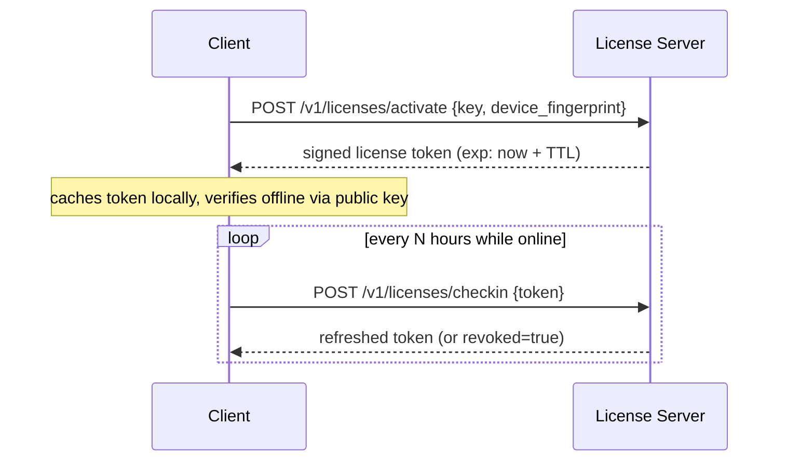

# Licensing System — API Design & Offline Behavior

## What kind of license are you actually building?

Pick this deliberately, it changes the whole design:

1. **Cloud SaaS, always-online** — you control the backend; every request can simply check subscription status server-side. No offline problem exists. Most B2C/B2B SaaS is this.
2. **Installed/desktop or on-prem software with occasional connectivity** — needs the offline-with-grace-period design below.
3. **Air-gapped/enterprise on-prem** — no internet access at all, ever. Needs signed license *files*, not API calls, with manual renewal.

Most of the "license system + API kaise hit hoga, offline kitne time chalega" question in practice is case 2. Here's the full design.

## The core idea: don't call the license server on every action

A naive design calls the license API on every sensitive action — this is slow, breaks the moment the network hiccups, and gives you no offline story at all. Instead:

1. **Activation**: on first run (or login), the client calls the license API once, over HTTPS, with the license key + a device fingerprint.
2. **Server validates**: checks license status (active/expired/revoked), seat count vs. devices already activated, and plan/feature entitlements.
3. **Server issues a signed, short-lived license token** (JWT or similar), not a simple boolean. This token is cryptographically signed with a private key that only the server holds.
4. **Client caches the token locally** (encrypted at rest if the platform allows it) and verifies it **locally**, offline, using the server's public key — no network call needed to check "am I licensed" on every action.
5. **Client re-activates periodically** (the "check-in" or "heartbeat") to refresh the token before it expires, and to let the server push revocations/plan changes down.



## Sample token claims

```json
{
  "sub": "tenant_3fae2b1e",
  "license_id": "lic_9c12",
  "plan": "pro",
  "features": ["multi_user", "api_access", "advanced_reports"],
  "seats": 25,
  "iat": 1732000000,
  "exp": 1732604800,
  "grace_exp": 1733814400
}
```

- `exp`: when the cached token itself expires and must be refreshed online.
- `grace_exp`: the outer bound — if the client can't reach the server *at all* past this point, the app moves to a degraded/locked state (see below). This is the actual answer to "offline hone par kitne time tak chalega": it's a deliberate product decision, not a technical constant — pick it based on how strict the license enforcement needs to be.

## Suggested grace-period bands (adjust to your product's risk tolerance)

| Product type | Online check-in interval | Offline grace period | Behavior after grace expires |
|---|---|---|---|
| Cloud SaaS (always connected) | Every request (server-side) | N/A | Immediate access change |
| Desktop app, normally online | Every 12–24h | 7–14 days | Degrade to read-only, don't delete local data |
| Field/offline-heavy app (sales reps, sites with poor connectivity) | Every few days | 14–30 days | Warn prominently, degrade gradually (e.g. disable new-record creation before fully locking) |
| Air-gapped enterprise | Manual, no auto check-in | License **file** valid for a fixed period (e.g. 90–365 days) | Renewed by manually installing a new signed license file |

Never hard-lock the moment the network drops — that produces support tickets from legitimate customers with a bad wifi day, not from people trying to pirate the software. Degrade gracefully and communicate clearly in the UI ("License couldn't be verified for 6 days — please connect within 8 more days").

## Verifying a license token offline (example, Node.js)

```ts
import { jwtVerify, importSPKI } from "jose";

const LICENSE_PUBLIC_KEY_PEM = process.env.LICENSE_PUBLIC_KEY!; // ships with the client build, safe to expose — it's a *public* key

export async function verifyLicenseOffline(cachedToken: string) {
  const publicKey = await importSPKI(LICENSE_PUBLIC_KEY_PEM, "EdDSA");
  const { payload } = await jwtVerify(cachedToken, publicKey);

  const now = Date.now() / 1000;
  if (now > payload.grace_exp) {
    return { status: "locked", payload };
  }
  if (now > payload.exp) {
    return { status: "grace_period", payload }; // still usable, nag to reconnect
  }
  return { status: "active", payload };
}
```

The **private** signing key never leaves the license server. The client only ever holds the **public** key, so even a fully reverse-engineered client cannot forge a valid license token — it can only verify one issued by you.

## License state machine

```
trial → active → past_due (grace) → suspended → expired/revoked
                     ↑___________________|
                (reactivation on payment/renewal)
```

Define explicit product behavior for each state (what features are visible, read-only vs blocked, what the UI says) — don't leave "past_due" as an undefined edge case discovered by a real customer.

## Anti-tamper notes (proportional to what you're protecting)

- Don't rely purely on local-only checks for high-value/enterprise licenses — pair the cached-token check with periodic server reconciliation, so a token that *should* have been revoked doesn't keep working forever if someone freezes the clock.
- Detect gross clock manipulation (compare system time against the last-known-good server time you stored on the last successful check-in; if system time has jumped backward, treat it as suspicious) — this stops the trivial "set your clock back" bypass without needing DRM-grade protection.
- Log activation/deactivation and seat usage server-side; expose it in the admin panel (file 04) so support and compliance can see real usage, not just trust the client.
- Be proportionate: consumer software doesn't need the same anti-tamper investment as licensing for safety-critical or high-value enterprise software. Don't over-engineer this for a low-stakes product.
