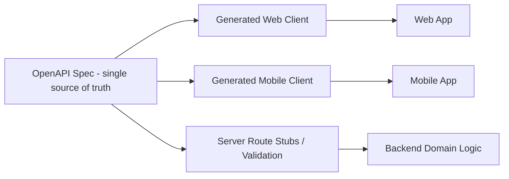

# Software + App Architecture — Keeping Web and Mobile in Sync Without Fake/Duplicate Validation

## The actual problem this file solves

"Fake validation" between a web app and a mobile app almost always comes from one root cause: **the same business rule gets implemented twice**, once by whoever built the web client and once by whoever built the mobile client — by hand, from memory, at different times. They drift. The web app allows something the API rejects; the mobile app blocks something the API would have allowed; a rule changes and only one client gets updated. Neither client's validation was ever "real" — it was a guess at what the backend does.

The fix is architectural, not a discipline problem to solve by being more careful:

## Rule 1: One backend is the one source of truth

All business rules — what's allowed, what's required, what triggers an error — live in the backend's domain layer (see file 01), and nowhere else. Clients never implement independent pass/fail logic for anything that matters (permissions, quotas, pricing, state transitions). Client-side "validation" is limited to:

- Input *shape* hints for UX (this field looks like it should be an email, show a red underline before submitting) — always re-validated by the server regardless.
- Reflecting entitlements the server already told the client about (e.g. "hide the export button because the server said this plan doesn't include exports") — the button being hidden is a UX nicety; the server still rejects the request if someone calls the API directly.

## Rule 2: Contract-first API design

Don't let each client hand-write its own guess at what the API looks like. Define the contract once:

- Write an **OpenAPI (Swagger) spec** as the actual source of truth for every endpoint — request/response shapes, error codes, auth requirements.
- Generate typed clients for both web and mobile from that same spec (`openapi-typescript`, `openapi-generator`, or your stack's equivalent) instead of hand-writing fetch/HTTP calls in each client.
- When the backend changes a field or a status code, regenerating the client is how both apps find out — not a Slack message that one team forgets to act on.
- Add **contract tests** (e.g. Pact, or simple recorded-interaction tests) to CI so a backend change that breaks a client's assumptions fails the build, not production.

## Rule 3: One auth system, both clients

- A single OAuth2/OIDC (or JWT-based) auth service issues tokens; both web and mobile authenticate against it the same way — don't build a separate, simpler auth path for mobile "to make it easier."
- Refresh-token rotation, with mobile tokens bound to a device identifier where the platform supports it, so a stolen refresh token is less useful off-device.
- Session/permission changes (role change, tenant suspension, password reset) should invalidate tokens promptly across both clients — test this specifically, it's a common gap.

## Rule 4: Versioning and deprecation, explicitly

- Version the API (`/v1/...`, or a version header) from day one, even before you think you need it.
- When you must break a contract, run old and new versions in parallel with a real deprecation window and a way to see which clients are still calling the old version (log the version/client build in every request).
- Never silently change response shape on an existing version — that's exactly the kind of drift that produces "fake validation"-looking bugs where the mobile app is technically calling a real endpoint but gets data it wasn't built to expect.

## When web and mobile genuinely need different response shapes — BFF pattern

If the mobile app needs a leaner payload (bandwidth-constrained) and the web dashboard needs a richer one, don't fork the business logic. Add a thin **Backend-for-Frontend** layer per client that calls the same core domain services and reshapes the response — validation and business rules still live in one place, only the presentation shape differs.

## Offline-capable mobile: sync without corrupting data

If the mobile app needs to work offline (common for field-use apps):

- Local cache/queue (SQLite, WatermelonDB, Realm, or platform equivalent) stores writes made while offline.
- Every mutation carries an **idempotency key** generated client-side, so a retried sync after a dropped connection can't double-apply the same change.
- Pick a conflict-resolution strategy deliberately and document it — last-write-wins is simplest and fine for most low-collision data; operational transforms or CRDTs are worth the complexity only for genuinely collaborative, high-collision data (e.g. simultaneous multi-user editing).
- Sync failures must be visible to the user ("3 changes couldn't sync") — a silently-failed sync that the user believes succeeded is a data-loss bug wearing a UX bug's clothes.

## Idempotency, generally

Every `POST`/`PUT`/`PATCH` that isn't naturally idempotent should accept an `Idempotency-Key` header, with the server storing recent keys and returning the original result for a repeat with the same key. This matters for both clients — mobile because of flaky connections, web because of accidental double-clicks/double-submits — and it's one backend feature that fixes the problem for both at once instead of client-side "disable the button after click" band-aids (keep those too, for UX, but they're not the real fix).

## Realtime/push, from one place

If either client needs live updates (notifications, live dashboards), implement it once in the backend (WebSocket/SSE/push-notification service) and have both clients subscribe to the same event stream — not a polling loop hand-rolled differently in each client.
