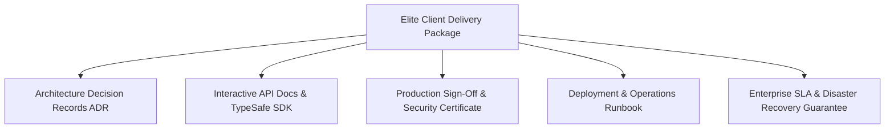

# Client Handoff, Enterprise Satisfaction & Delivery Protocol

The difference between a junior freelancer and an elite SaaS engineering studio is how the project is handed over to the client. A client who receives a ZIP file with no documentation will feel anxious, encounter bugs, and demand endless revisions. A client who receives an executive-grade handoff package will be blown away, pay invoices instantly, and refer high-ticket enterprise contracts.

---

## 1. The 5 Pillars of Client Satisfaction



### Pillar 1: Architecture Decision Records (ADR)
Provide a clear record of why technical decisions were made:
- Why PostgreSQL + RLS was chosen instead of MongoDB for multi-tenancy.
- Why Stripe was chosen and how webhook idempotency prevents double charging.
- Why Redis was implemented for sliding window rate limiting.
*Impact*: When the client shows this to investors or an incoming CTO, it looks like a million-dollar engineering build.

### Pillar 2: Interactive API Documentation
- Auto-generate Swagger/OpenAPI 3.1 or Scalar interactive API documentation.
- Export Postman / Insomnia collections with pre-configured authentication headers.
- Provide a typed TypeScript SDK for client frontend/mobile teams.

### Pillar 3: Production Sign-Off & Security Certificate
Generate the official delivery certificate:
```bash
npx saas-master report "Client Company Name"
```
Attach verifiable evidence:
- Automated test run showing 100% pass rate.
- Cross-tenant data isolation test showing 0 leaks.
- Static security scan showing 0 critical vulnerabilities.

### Pillar 4: Operations & Maintenance Runbook
Provide clear, step-by-step guides for routine tasks:
- How to invite a superadmin to the dashboard.
- How to rotate database credentials and Stripe webhook secrets.
- How to restore a database backup in under 15 minutes.
- How to configure custom domains (CNAME + SSL).

### Pillar 5: Enterprise SLA Commitment
Define formal uptime, maintenance windows, and incident response times (see `templates/ENTERPRISE_SLA_TEMPLATE.md`).

---

## 2. The Final Client Handover Meeting Agenda (30 Minutes)

1. **Architecture Walkthrough (10 mins)**: High-level system diagram and multi-tenant security model.
2. **Core Feature Demo (10 mins)**: Live demonstration of auth, Stripe billing upgrade, invite flow, and admin audit log.
3. **Emergency Procedures (5 mins)**: Where to check error logs (Sentry), where database backups live, and how to contact support.
4. **Formal Sign-off & Repository Transfer (5 mins)**: Transfer GitHub repo ownership, invite client to production cloud console, and sign acceptance document.
