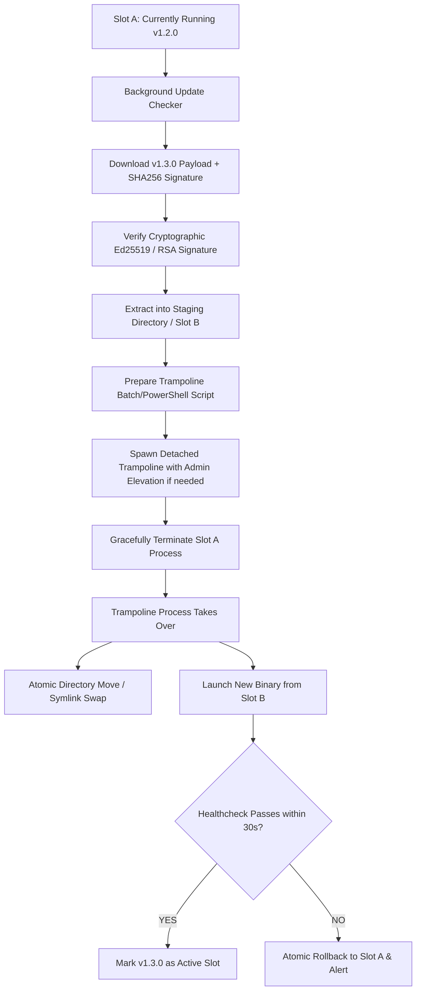

# Zero-Breakage Auto-Update, Self-Healing & Binary Distribution

The single biggest maintenance nightmare in desktop, on-prem, self-hosted, and client-side SaaS software is the **update failure trap**:
- Update runs in Windows PowerShell or CMD without administrator privileges and silently crashes.
- Executable files are locked by the running process (`EBUSY` / `Access Denied`), leaving a corrupt half-updated application.
- The developer is forced to tell the customer: *"Please uninstall, delete the old folder manually, and install the new version"*. This destroys credibility with enterprise buyers.

This guide provides the **dual-slot transactional atomic update architecture** used by Chrome, VS Code, and Slack to achieve 99.999% update reliability across Windows, macOS, and Linux without breaking.

---

## 1. The Dual-Slot (A/B) Trampoline Architecture

Never overwrite a running binary directly in place. Operating systems place an exclusive file lock on executing binaries.



---

## 2. Solving Windows File Locks & Permission Elevation (UAC)

Windows prevents deleting or writing to an executable currently loaded in memory. If installed in `C:\Program Files`, it also requires UAC administrator elevation.

### Technique 1: User-Space Installation (No UAC Required)
Unless your app installs a kernel driver or Windows Service, **always default to per-user installation**:
- Install path: `%LOCALAPPDATA%\Programs\<YourAppName>`
- Configuration: `%APPDATA%\<YourAppName>`
- *Advantage*: Zero UAC prompts needed for auto-updating. The user account has native write permissions to `%LOCALAPPDATA%`.

### Technique 2: The Self-Deleting Trampoline Script (`trampoline.bat`)
When the app needs to swap binaries on Windows, it writes a small trampoline script to `%TEMP%`, launches it in a detached process, and exits immediately:

```bat
@echo off
:: Wait for parent process to fully release file locks (max 10 seconds)
set RETRIES=0
:WAIT_LOOP
timeout /t 1 /nobreak >nul
2>nul (
  >> "%~dp0\current\app.exe" echo off
) && goto SWAP_FILES
set /a RETRIES+=1
if %RETRIES% GEQ 10 goto ROLLBACK_FAIL
goto WAIT_LOOP

:SWAP_FILES
:: Atomic move: Rename old to backup, move new to current
if exist "%~dp0\current_backup" rmdir /s /q "%~dp0\current_backup"
ren "%~dp0\current" "current_backup"
ren "%~dp0\staging" "current"

:: Launch the updated application
start "" "%~dp0\current\app.exe" --post-update
exit 0

:ROLLBACK_FAIL
:: Restore previous version if swap failed
echo Update failed. Restoring backup... >> "%~dp0\update_error.log"
start "" "%~dp0\current\app.exe" --update-failed
exit 1
```

---

## 3. Cryptographic Signature & Hash Verification

Never allow an updater to execute an unsigned payload. An attacker hijacking DNS or a CDN can push remote code execution (RCE) to all your client machines.

1. **Hash Verification**: Compute `SHA-256` of the downloaded archive and compare against the manifest signed by your release server.
2. **Signature Verification**: Every release manifest MUST be signed using your private release key (Ed25519). The updater ships with the hardcoded Public Key:
   ```ts
   import { ed25519 } from '@noble/curves/ed25519';

   export function verifyUpdateManifest(manifestBytes: Uint8Array, signatureHex: string, publicKeyHex: string): boolean {
     return ed25519.verify(signatureHex, manifestBytes, publicKeyHex);
   }
   ```

---

## 4. Database Schema Auto-Migration During Binary Updates

If the client application uses an embedded database (SQLite / DuckDB / PGlite):
- **Backup Before Migration**: Always copy `<db_name>.sqlite` to `<db_name>.sqlite.bak.<timestamp>` before applying migrations.
- **Transactional Migrations**: Run all migration steps inside an atomic database transaction (`BEGIN TRANSACTION ... COMMIT`).
- **Rollback on Error**: If any migration SQL throws an error:
  1. Roll back the transaction.
  2. Restore `<db_name>.sqlite` from the `.bak` copy.
  3. Abort the binary update and notify the server telemetry.
