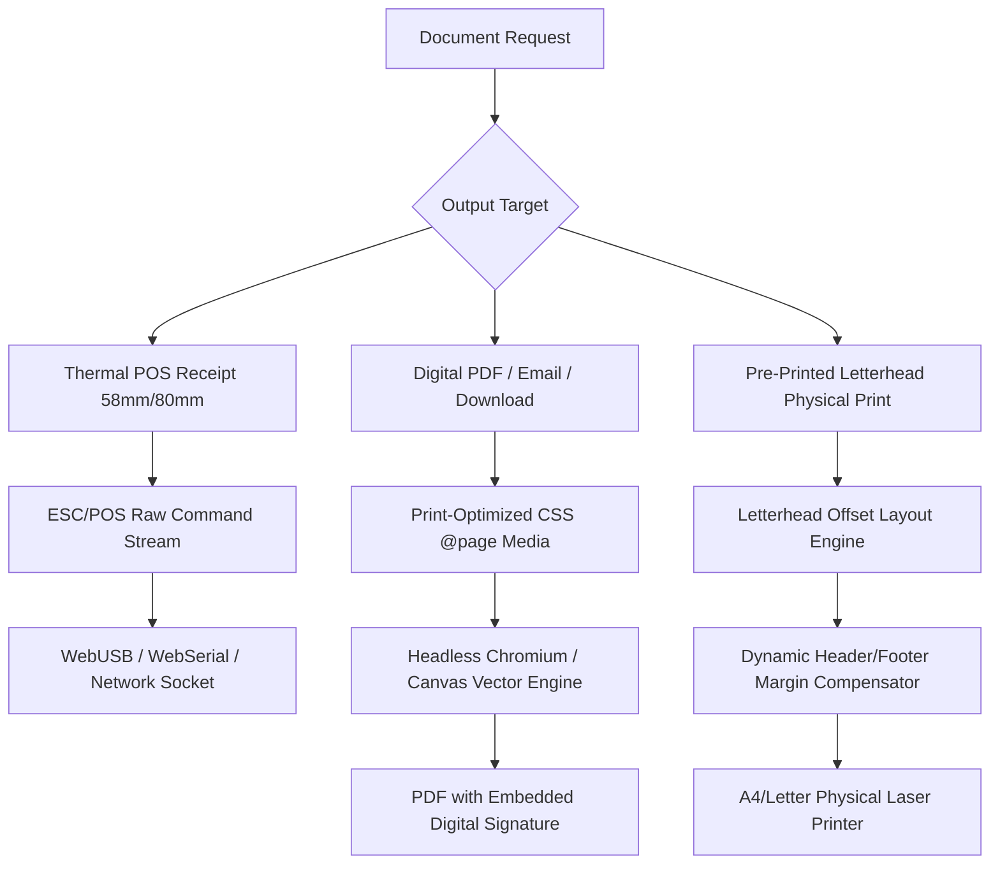

# Universal Document, Invoicing & Hardware Printing Engine

Whether building an ERP, diagnostic lab management system, healthcare clinic, retail POS, or B2B invoicing SaaS, document output and hardware printing are critical failure points:
- Tables overflowing off the page on A4 prints.
- Pre-printed corporate/hospital letterheads colliding with printed content.
- Thermal receipt printers printing unreadable text or failing to cut paper.
- Invoice sequence numbers containing gaps during concurrent checkouts, triggering tax audits.

This reference provides a universal, industry-agnostic engine for pixel-perfect documents, thermal printing, and fiscal compliance.

---

## 1. The Three Document Delivery Modes



---

## 2. Zero-Gap Concurrency-Safe Invoice Numbering

In many jurisdictions (EU VAT, India GST, LATAM CFDI), invoice numbers MUST be sequential with **zero missing numbers**. A standard `id SERIAL` or UUID cannot be used because rolling back a failed transaction burns the ID, creating illegal gaps.

### The Fiscal Sequence Pattern (PostgreSQL):
```sql
CREATE TABLE IF NOT EXISTS invoice_sequences (
    organization_id UUID NOT NULL REFERENCES organizations(id),
    financial_year VARCHAR(10) NOT NULL, -- e.g. '2026-2027'
    prefix VARCHAR(20) NOT NULL,         -- e.g. 'INV', 'LAB', 'ORD'
    last_number BIGINT DEFAULT 0 NOT NULL,
    PRIMARY KEY (organization_id, financial_year, prefix)
);

-- Concurrency-Safe Invoice Generation Function
CREATE OR REPLACE FUNCTION generate_next_invoice_number(
    p_org_id UUID,
    p_fin_year VARCHAR,
    p_prefix VARCHAR
) RETURNS TEXT AS $$
DECLARE
    next_num BIGINT;
BEGIN
    -- Row-level lock on the specific sequence row prevents race conditions
    INSERT INTO invoice_sequences (organization_id, financial_year, prefix, last_number)
    VALUES (p_org_id, p_fin_year, p_prefix, 1)
    ON CONFLICT (organization_id, financial_year, prefix)
    DO UPDATE SET last_number = invoice_sequences.last_number + 1
    RETURNING last_number INTO next_num;

    RETURN p_prefix || '/' || p_fin_year || '/' || LPAD(next_num::TEXT, 6, '0');
END;
$$ LANGUAGE plpgsql;
```

---

## 3. Letterhead Calibration Engine (Physical Pre-Printed vs Digital)

When printing invoices, pathology lab reports, or legal contracts:
- **Scenario A: Print on Plain A4**: The software must render the company header (logo, address, contact, tax IDs) and footer.
- **Scenario B: Print on Pre-Printed Stationery**: The company already has pre-printed letterhead paper in the printer tray. The software MUST leave an exact blank margin (e.g. `45mm` top, `30mm` bottom) so text does not overlap with the physical logo.

### CSS `@page` Print Layout Contract:
```css
@media print {
  @page {
    size: A4 portrait;
    /* Configurable dynamic margins set via inline style or CSS variable */
    margin-top: var(--print-header-offset, 15mm);
    margin-bottom: var(--print-footer-offset, 15mm);
    margin-left: 12mm;
    margin-right: 12mm;
  }

  body {
    -webkit-print-color-adjust: exact;
    print-color-adjust: exact;
    font-family: -apple-system, BlinkMacSystemFont, "Segoe UI", Roboto, sans-serif;
  }

  /* Prevent page breaks inside critical elements */
  .no-break, tr, .signature-block, .qr-section {
    break-inside: avoid !important;
    page-break-inside: avoid !important;
  }

  /* Force page break when starting a new section */
  .page-break {
    break-before: page !important;
    page-break-before: page !important;
  }

  /* Toggle digital letterhead elements */
  .digital-letterhead {
    display: var(--show-digital-letterhead, block);
  }
}
```

---

## 4. ESC/POS Thermal Printing (58mm / 80mm Hardware)

Thermal printers cannot interpret complex HTML/CSS. They consume raw ESC/POS binary command bytes:
- Paper width: 32 characters (58mm) or 48 characters (80mm).
- Command codes: `ESC @` (Initialize), `ESC !` (Font size/bold), `GS V` (Full/partial cut), `ESC p` (Kick cash drawer).

### Universal Byte Stream Principles:
1. **Initialize Buffer**: Always send `\x1B\x40` (ESC @) at the beginning of every print job to clear previous hardware state.
2. **Text Alignment**: Use hardware alignment commands (`\x1B\x61\x00` Left, `\x1B\x61\x01` Center, `\x1B\x61\x02` Right).
3. **Paper Feed & Cut**: Send at least 3 blank line feeds (`\x0A\x0A\x0A`) before the cut command (`\x1D\x56\x41\x00`) so the footer is not chopped off.
4. **Barcode / QR Code**: Always print standard Code 128 or QR Model 2 with error correction level M.
