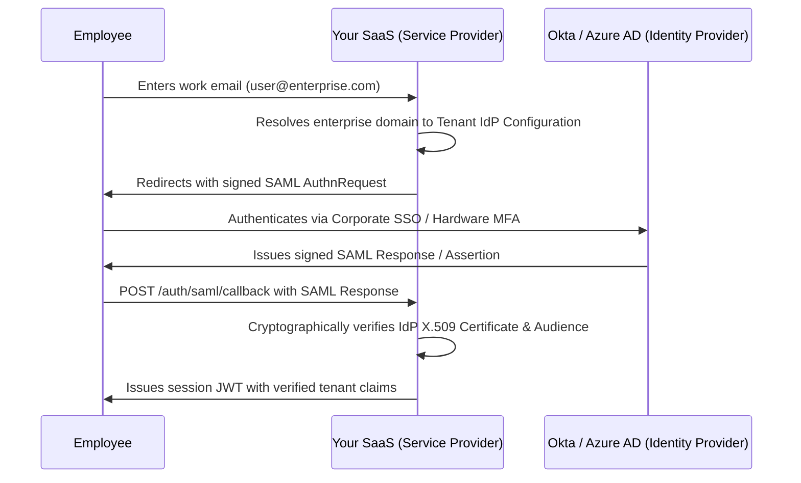

# Enterprise Identity, SSO (SAML/OIDC), SCIM & Impersonation Security

Enterprise clients (Fortune 500, banks, healthcare systems, government bodies) will never purchase a SaaS product that relies on basic email/password authentication or amateur admin backdoors.

This reference codifies the security standards required by corporate CISOs: Enterprise Single Sign-On (SAML 2.0 / OIDC), Automated Directory Sync (SCIM 2.0), and Cryptographically Audited Superadmin Impersonation.

---

## 1. Enterprise SSO Architecture (SAML 2.0 & OIDC)



### Critical SAML Security Rules:
- **Enforce InResponseTo Validation**: Prevents SAML Assertion replay attacks.
- **Clock Skew Tolerance**: Allow max 120 seconds of clock skew between server and IdP.
- **Strict Domain Binding**: An enterprise domain (e.g. `@acmecorp.com`) must only ever authenticate into its assigned `organization_id`. Prevent cross-tenant domain hijacking.

---

## 2. SCIM 2.0 (Automated Employee Provisioning & Deprovisioning)

When an employee leaves the customer's enterprise, their IT department deactivates them in Okta or Azure AD. Your SaaS must instantly revoke access via SCIM webhooks to prevent terminated employees from accessing corporate data.

### Supported Endpoints:
- `GET /scim/v2/Users`: List users for directory audit.
- `POST /scim/v2/Users`: Provision new user upon hire.
- `PUT /scim/v2/Users/{id}` / `PATCH /scim/v2/Users/{id}`: Update roles or set `"active": false`.
- `DELETE /scim/v2/Users/{id}`: Immediate deprovisioning.

All SCIM endpoints must be authenticated via a unique, per-tenant bearer token generated in the enterprise customer settings.

---

## 3. Cryptographically Audited Superadmin Impersonation

When your support engineers need to assist a customer, NEVER use backdoors, password overrides, or universal admin bypasses.

### The Enterprise Impersonation Protocol:
1. **Mandatory Ticket Justification**: Superadmin must input a valid support ticket ID (e.g. `TICKET-8492`) and business reason before generating an impersonation session.
2. **Ephemeral Token Generation**:
   - Issue a short-lived delegation token (TTL max 30–60 minutes).
   - Sign with asymmetric private key.
   - Include explicit claims:
     ```json
     {
       "sub": "user_customer_target_id",
       "impersonated_by": "admin_engineer_id",
       "organization_id": "tenant_target_id",
       "is_impersonation": true,
       "reason": "Debugging invoice sync error - Ticket #8492",
       "exp": 1732608400
     }
     ```
3. **Persistent UI Warning Banner**: When an impersonated session is active, render an immovable top banner:
   *"⚠️ You are impersonating [Customer Name] as [Admin Email]. All actions are cryptographically recorded."*
4. **Restricted Actions**: Disallow updating the customer's payment credit card, exporting full organization data, or transferring organization ownership while in impersonation mode.
5. **Immutable Audit Event**: The event is recorded in the append-only `audit_logs` table before the session is created.

---

## 4. API Key Security & KMS Key Rolling

- **Never Store Raw API Keys**: Store only `sha256(apiKey)` in the database.
- **Display Once**: Display the raw API key (e.g. `smb_live_94f8b2...`) to the developer once upon creation. If lost, they must generate a new key.
- **Key Rolling Window**: When rotating production keys, provide a 24-hour overlapping grace window where both the old and new keys are valid to prevent downtime in client background workers.
