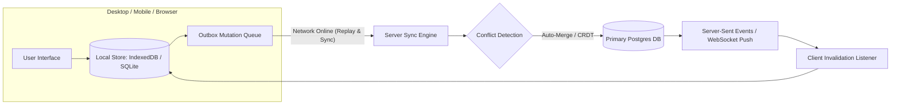

# Offline-First, Local Data Synchronization & CRDTs

A SaaS product that displays a blank white screen or a "Network Disconnected" error when Wi-Fi drops cannot serve field workers, retail cashiers, healthcare practitioners, or mobile sales teams.

This reference outlines the architecture of **Offline-First SaaS**: local embedded storage, optimistic mutation queues, and deterministic conflict resolution using CRDTs (Conflict-free Replicated Data Types) and Vector Clocks.

---

## 1. The Offline-First Data Topology



---

## 2. The Local Mutation Outbox Pattern

Never block client interactions on network HTTP round-trips:
1. **Optimistic Local Write**: When a user creates or edits a record, write immediately to the local database (SQLite or IndexedDB) with status `'pending_sync'`.
2. **Enqueue in Outbox**: Push the mutation payload into a durable local table `sync_outbox`:
   ```sql
   CREATE TABLE sync_outbox (
       id TEXT PRIMARY KEY,
       table_name TEXT NOT NULL,
       operation TEXT NOT NULL, -- 'INSERT', 'UPDATE', 'DELETE'
       record_id TEXT NOT NULL,
       payload JSON NOT NULL,
       client_timestamp BIGINT NOT NULL,
       attempts INT DEFAULT 0
   );
   ```
3. **Background Drain Worker**: A background worker checks for network connectivity (`navigator.onLine` / ping check) and drains the outbox in FIFO order with exponential backoff.

---

## 3. Conflict Resolution Strategies

When two users edit the exact same document or row while disconnected, how do you prevent data loss?

### Strategy 1: Field-Level Last-Write-Wins (LWW) with Hybrid Logical Clocks
Instead of overwriting the whole row, track timestamps on individual columns:
- User A edits `customer.phone_number` at 10:00:02.
- User B edits `customer.billing_address` at 10:00:05.
- Both updates succeed and merge automatically because they touched distinct fields!

### Strategy 2: State-Based CRDTs (Conflict-Free Replicated Data Types)
For collaborative text (documents, notes) or counter allocations (inventory counts):
- Use CRDT primitives (Yjs / Automerge / LWW-Element-Set).
- Invariants: Commutative ($A + B = B + A$), Associative ($(A + B) + C = A + (B + C)$), and Idempotent ($A + A = A$).
- Guarantees that regardless of arrival order, all clients converge to the exact same state without human intervention.

---

## 4. Tombstone Deletions

Never run a hard `DELETE FROM table WHERE id = ?` in an offline-first system. If Client A deletes a record while Client B is offline, Client B's next sync will see Client A missing that record and accidentally re-insert it!
- Always use **Tombstones**: `deleted_at TIMESTAMPTZ` and `is_deleted BOOLEAN DEFAULT FALSE`.
- Propagate the tombstone to all connected nodes during sync.
- Run a vacuum/garbage-collection worker on the server to purge tombstones older than 90 days.
