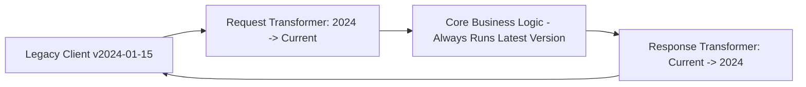

# Bulletproof Versioning, Backward Compatibility & 100-Year Architecture

Software breaks across updates when developers make breaking changes to APIs, database schemas, or serialized contracts. The world's most resilient software systems (Stripe API, Linux Kernel syscalls, SQLite file format) adhere to strict immutability and additive-only rules.

This reference codifies the architectural rules that guarantee your SaaS can evolve for decades without breaking a single running client or mobile app in the wild.

---

## 1. The Stripe-Style Date-Based Versioning Architecture

Never use `/v1/`, `/v2/`, `/v3/` URL versioning that forces you to rewrite your entire backend codebase every time a field changes.

### The Transformation Layer Pattern:
1. **Master Schema**: Your internal domain models and database always run on the **latest, newest schema**.
2. **Version Pinning**: Every tenant/client is pinned to the API version active when they signed up (e.g. `2026-09-01`).
3. **Bidirectional Request/Response Decorators**:
   - When an incoming request arrives from an older client version, a backwards transformation decodes the old format into the latest internal schema.
   - When an outgoing response returns to the client, a backwards transformation formats the latest data into the legacy shape expected by that version.

---

## 2. The 5 Inviolable Laws of Schema Evolution

- **Law 1: Additive-Only Changes**: You may add new fields, new endpoints, or optional query parameters. You may **NEVER** remove a field or rename an existing field in place.
- **Law 2: Deprecate Before Deletion**: If a field `legacy_name` must be replaced by `full_name`, both fields MUST be returned simultaneously for a minimum 12-month deprecation period.
- **Law 3: Never Change Field Types**: Never convert an integer ID to a string UUID or a string to an array on an existing field. Create a new field `id_v2` or `tags_list` instead.
- **Law 4: Tolerant Reader (Postel's Law)**: *"Be conservative in what you send, be liberal in what you accept."* Clients must ignore unknown or extra fields in JSON responses instead of crashing during deserialization.
- **Law 5: Schema Drift Verification in CI**: Run automated contract diffing tools (e.g. `openapi-diff` or `buf` for Protobuf) in your CI/CD pipeline. Any PR containing a breaking change must fail the build automatically.

---

## 3. Persistent Client Contract Stability

- **Mobile Apps Never Auto-Update Simultaneously**: At any given moment, 15% of your mobile app users are running builds that are 6 to 18 months old because they turned off automatic App Store updates. If you remove an API endpoint, their app will crash instantly.
- **Database Migrations Must Run Concurrent with Old Binaries**: The database must support the currently running production version $N$ and the newly deploying version $N+1$ simultaneously (see `references/13-database-migrations-disaster-recovery.md`).
