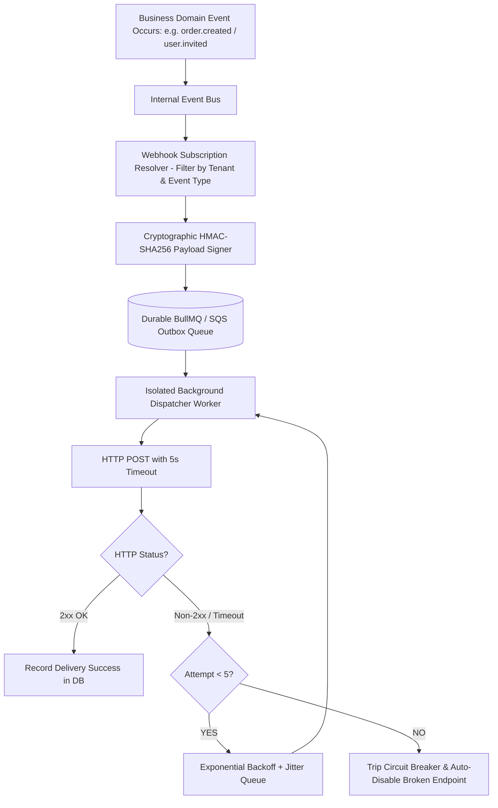

# Universal Outbound Webhooks & Event Dispatching Architecture

Every successful SaaS platform (Stripe, GitHub, Shopify, Slack, Twilio) eventually transforms into an ecosystem. To allow customers and third-party developers to automate workflows, your SaaS must support **Outbound Webhooks** — delivering real-time HTTP event notifications to customer-configured URLs.

Building an outbound webhook system is not simply calling `axios.post(url, data)`. A naive implementation will suffer from hanging connection thread starvation, denial-of-service against your own servers when a customer URL is down, replay attacks, and payload tampering.

---

## 1. The Core Outbound Webhook Lifecycle



---

## 2. Cryptographic Security & Tamper Proofing

Your customers must be able to verify that an incoming HTTP request genuinely originated from your SaaS platform and was not forged or altered in transit.

### The Standard: HMAC-SHA256 Signatures (`X-Hub-Signature-256`)
1. When a tenant registers an endpoint, generate a high-entropy secret key: `whsec_...` (e.g. 32 random bytes hex-encoded).
2. For each outgoing request, sign `timestamp + "." + payloadJson`:
   ```ts
   const signature = crypto
     .createHmac('sha256', endpointSecret)
     .update(`${timestamp}.${payloadJson}`)
     .digest('hex');
   ```
3. Send standard headers:
   - `X-Webhook-ID`: Unique delivery attempt UUID (for deduplication).
   - `X-Webhook-Timestamp`: Unix epoch in seconds (prevents replay attacks older than 5 minutes).
   - `X-Webhook-Signature`: `t=1732608000,v1=3fae2b1e...`

---

## 3. Defense Against Malicious Endpoints (SSRF & Timeouts)

A malicious tenant could configure their webhook destination as:
- `http://169.254.169.254/latest/meta-data/` (AWS Cloud Metadata SSRF).
- `http://192.168.1.1` (Internal local network scan).
- A "slow loris" server that holds HTTP connections open for 10 minutes to exhaust your server sockets.

### Hardened Dispatch Rules:
1. **SSRF Filter**: Resolve the target domain's IP address before connecting. Disallow loopback (`127.0.0.1`), link-local (`169.254.0.0/16`), and private RFC 1918 subnets (`10.0.0.0/8`, `172.16.0.0/12`, `192.168.0.0/16`).
2. **Strict Timeouts**: Max connection timeout = 3 seconds; max read timeout = 5 seconds.
3. **Payload Truncation**: Enforce maximum payload size (e.g. 256 KB). Large binary files should be referenced via temporary signed download URLs, never dumped directly into a webhook body.

---

## 4. Exponential Backoff & Circuit Breakers

If a customer's server crashes, hammering them every 2 seconds will keep their server down.
- **Retry Schedule**:
  - Attempt 1: Immediate
  - Attempt 2: + 1 minute
  - Attempt 3: + 10 minutes
  - Attempt 4: + 1 hour
  - Attempt 5: + 12 hours
- **Automatic Deactivation (Circuit Breaker)**: If an endpoint fails continuously for 72 consecutive hours with zero successful responses, automatically transition its status to `disabled` and send an alert email to the tenant administrator.
