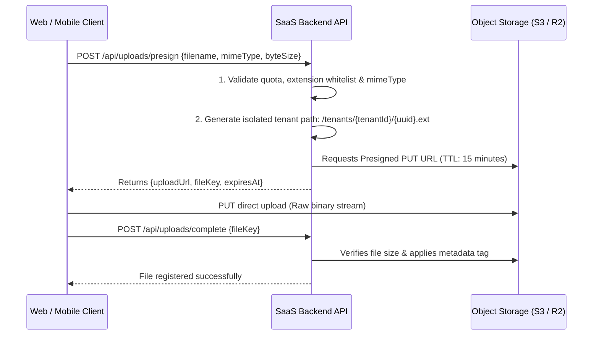

# Secure Object Storage & Direct-to-S3 Large File Uploads

Allowing users to upload files is one of the most common vectors for remote code execution, server memory starvation, and cross-tenant data leaks. 

A naive SaaS API endpoint `POST /api/upload` that accepts `multipart/form-data` directly into Node.js application memory will crash under high concurrency when multiple users upload 50MB+ files simultaneously.

---

## 1. The Direct-to-Storage Presigned Architecture

Never route file bytes through your application server. The application server only issues **time-bounded cryptographically signed upload tokens**. The client uploads directly to Object Storage (AWS S3, Cloudflare R2, Google Cloud Storage).



---

## 2. Multi-Tenant Storage Isolation

Object storage buckets are shared, which means object keys must be strictly partitioned:

### Path Convention:
```
s3://your-company-production/tenants/{organization_id}/uploads/{file_id}.{ext}
```

### Access Rules:
1. **Public Buckets are Forbidden**: The entire S3 bucket must have **Block Public Access** enabled at the cloud provider level.
2. **Private Downloads via Signed Get URLs**: When a user wants to view or download a file, the API verifies the user belongs to `organization_id` before issuing a temporary `GET` signed URL valid for 5 to 60 minutes.
3. **No Direct Predictable URLs**: Never expose raw S3 URLs in frontend HTML; always issue time-limited signed URLs or stream through an authenticated CDN edge worker.

---

## 3. Upload Security Gates

1. **MIME-Type & Magic Byte Validation**: Do not trust the file extension in `filename`. Verify magic byte headers (e.g. `\xFF\xD8\xFF` for JPEG, `\x89\x50\x4E\x47` for PNG, `%PDF` for PDF).
2. **SVG Threat Mitigation**: SVG files are XML and can contain embedded `<script>` tags that execute Cross-Site Scripting (XSS) when rendered in the browser. Always sanitize SVGs (e.g. with DOMPurify) and serve them with `Content-Disposition: attachment` or `Content-Security-Policy: script-src 'none'`.
3. **Chunked Multipart Uploads for Large Files (> 100MB)**: For large files (backups, videos, large CSV datasets), use S3 Multipart Upload API to allow pause, resume, and parallel chunk transmission without network failure restart.
