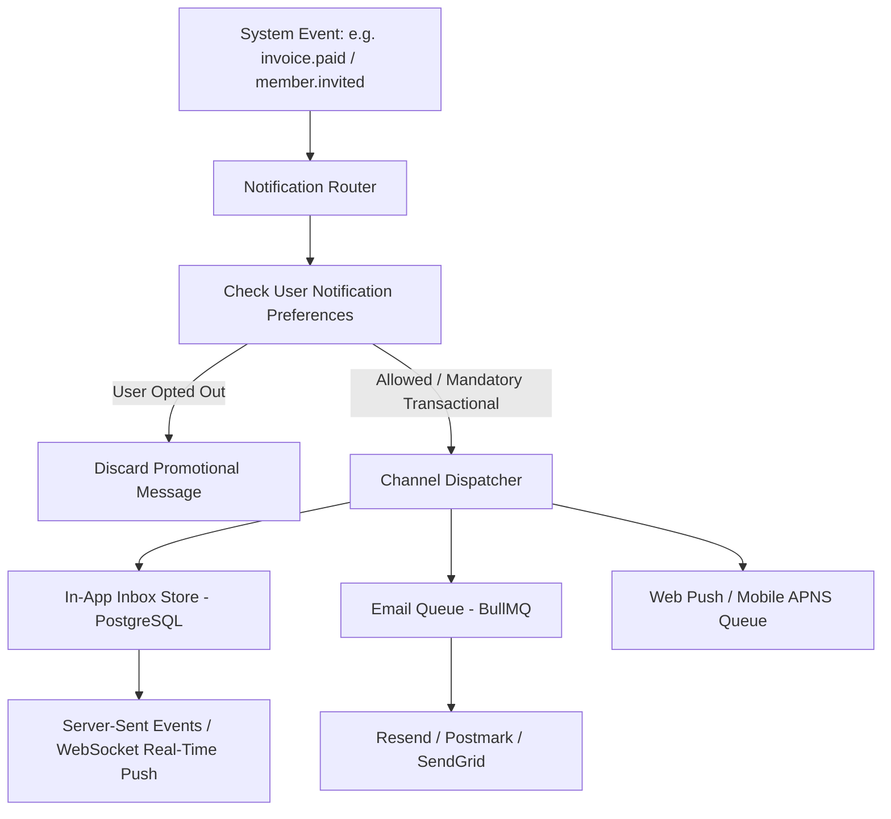

# Omni-Channel Notifications & In-App Notification Center

Notifications are the primary driver of SaaS user retention and critical operational alerts. However, poorly architected notifications quickly lead to customer churn:
- Users bombarded with duplicated emails for single actions.
- Unsubscribe links missing or broken (violating CAN-SPAM, GDPR, and India DPDP Act).
- Slow third-party email APIs blocking HTTP request threads.
- In-app notification bell counters getting out of sync with real read states.

---

## 1. The Omni-Channel Notification Hub



---

## 2. Notification Classification & Legal Compliance

Every notification dispatched by the system MUST belong to one of two strict classes:

| Category | Can User Unsubscribe? | Delivery SLA | Examples |
|---|---|---|---|
| **Transactional / Critical** | **NO** (Legally required operational notice) | Immediate (< 10 seconds) | Password reset, invoice receipt, account lock alert, security login from new IP |
| **Product / Activity / Digest** | **YES** (Must provide 1-click unsubscribe) | Batched / Low priority | New comment on project, weekly summary report, onboarding tips |

---

## 3. High-Performance In-App Notification Center Schema

In-app notification centers must support fast unread count queries without table scans:

```sql
CREATE TABLE IF NOT EXISTS in_app_notifications (
    id UUID PRIMARY KEY DEFAULT gen_random_uuid(),
    organization_id UUID NOT NULL REFERENCES organizations(id) ON DELETE CASCADE,
    user_id UUID NOT NULL REFERENCES users(id) ON DELETE CASCADE,
    title VARCHAR(255) NOT NULL,
    body TEXT NOT NULL,
    action_url TEXT,
    category VARCHAR(50) DEFAULT 'activity' NOT NULL,
    is_read BOOLEAN DEFAULT FALSE NOT NULL,
    read_at TIMESTAMPTZ,
    created_at TIMESTAMPTZ DEFAULT NOW() NOT NULL
);

-- Compound index optimized for: WHERE user_id = ? AND is_read = false
CREATE INDEX IF NOT EXISTS idx_notifications_user_unread 
ON in_app_notifications(user_id, is_read, created_at DESC);
```

---

## 4. Digest Batching (Prevent Notification Fatigue)

If a team member creates 50 items in 5 minutes, sending 50 individual emails will cause the customer to block your domain.
- Implement a **15-minute debouncing / digest window**:
- When an event occurs, push to Redis with a 15-minute delayed job: `notify:digest:{userId}`.
- If more events arrive within the window, aggregate them into a single summary email: *"Alice created 14 new tasks in Project Alpha."*
