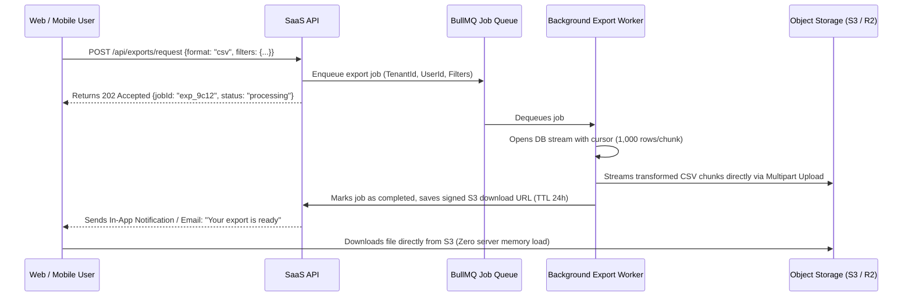

# Asynchronous Data Exports & High-Volume Streaming Pipelines

Every SaaS customer eventually demands: *"Export all my data to CSV / Excel"*.

Attempting to fulfill a 100,000-row export inside an HTTP request handler (`GET /api/export`) will result in:
- Gateway timeout (`504 Gateway Timeout` after 30 seconds).
- Application memory exhaustion (`JavaScript heap out of memory`).
- Complete lockup of the database connection pool while reading massive unindexed tables.

---

## 1. The Asynchronous Export Architecture



---

## 2. Memory-Safe Database Streaming

Never load the entire database query into an in-memory array (`SELECT * FROM orders` into `rows[]`). Use database streaming cursors:

```ts
import QueryStream from 'pg-query-stream';
import { pipeline } from 'stream/promises';
import { stringify } from 'csv-stringify';
import zlib from 'zlib';
import fs from 'fs';

export async function streamExportToDisk(client: any, tenantId: string, outputFilePath: string) {
  // Query stream reads 1,000 rows at a time from Postgres cursor
  const streamQuery = new QueryStream(
    'SELECT id, name, created_at, status FROM orders WHERE organization_id = $1 ORDER BY created_at DESC',
    [tenantId],
    { batchSize: 1000 }
  );

  const dbStream = client.query(streamQuery);
  const csvTransformer = stringify({ header: true });
  const gzipCompressor = zlib.createGzip();
  const fileWriter = fs.createWriteStream(outputFilePath);

  // Pipe DB -> CSV -> GZIP -> File with automatic backpressure handling
  await pipeline(dbStream, csvTransformer, gzipCompressor, fileWriter);
}
```

---

## 3. CSV Injection (Formula Injection) Defense

If a customer inputs their company name as `=cmd|' /C calc'!A0` or `=SUM(1+1)`, opening the exported CSV in Microsoft Excel or Google Sheets can execute arbitrary system commands on the user's computer.

### The Sanitization Rule:
Any cell beginning with `= `, `+`, `-`, `@`, `\t`, or `\r` MUST be prefixed with a single quote (`'`) to neutralize Excel formula execution:

```ts
export function sanitizeCsvCell(value: any): string {
  if (typeof value !== 'string') return String(value ?? '');
  const trimmed = value.trim();
  if (/^[=+\-@\t\r]/.test(trimmed)) {
    return `'${trimmed}`;
  }
  return trimmed;
}
```
