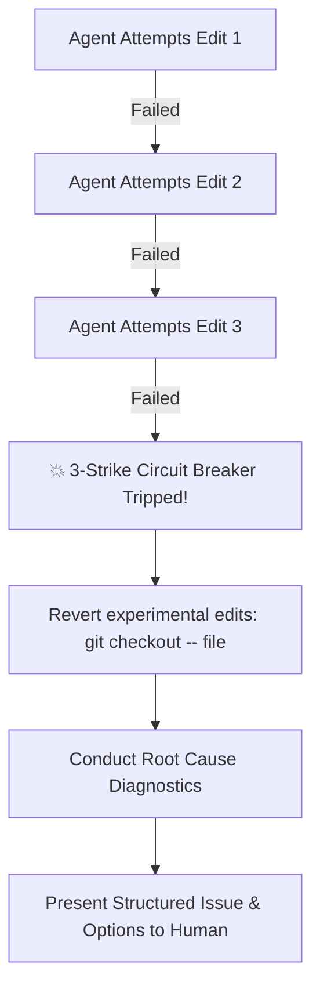

# Chapter 32 — Agentic Governance, Surgical Scope & The Model Context Protocol (MCP)

> "An AI coding agent without constitutional boundaries is an unpredictable liability; an AI agent bound by enterprise laws and empowered with real-time MCP tooling is a 100x force multiplier."

---

## 1. The Autonomous Agent Crisis in SaaS Development

When AI coding agents (Claude, Cursor, Devin, Windsurf, Copilot) are unleashed on multi-tenant SaaS codebases without strict constitutional discipline, four failure modes consistently destroy production systems:

1. **Drive-By Refactoring**: An agent tasked with adding an invoice field unnecessarily rewrites the entire billing controller, changes date formatting across unrelated files, and introduces silent regressions.
2. **Infinite Thrash Loops (Hallucination Cascades)**: When an agent encounters a failing test or schema error, it generates random patches on top of patches, compounding errors until the codebase is irrecoverable.
3. **Data-Loss Blunders**: An agent attempting to "reset test state" issues `DROP DATABASE` or `git reset --hard` wiping out hours of uncommitted engineering progress.
4. **Sycophantic Security Degradation**: When a prompt says "just make this endpoint work quickly", the agent disables JWT validation, removes RLS policies, or hardcodes live API keys.

To build unbreakable, multi-billion-dollar SaaS systems, agents must operate under **The SaaS Master Agentic Constitution**.

---

## 2. The 16 Non-Negotiable Constitutional Laws

Every AI agent and human engineer working with SaaS Master Builder is governed by 16 immutable laws:

| # | Constitutional Law | Engineering Mandate | Catastrophic Failure Mode Prevented |
|---|-------------------|---------------------|-------------------------------------|
| **1** | PostgreSQL Row-Level Security | All customer tables must have RLS forced | Cross-tenant data leaks and GDPR breach |
| **2** | Server-Side Tenant Extraction | Extract tenant ID from verified JWT session claims | Tenant spoofing via forged request headers |
| **3** | Forced RLS on Customer Tables | `FORCE ROW LEVEL SECURITY` on every table | Accidental bypass by table owners or superusers |
| **4** | Webhook Cryptographic Signatures | Verify signatures (`constructEvent`) before parsing | Spoofed payments and unauthorized tier upgrades |
| **5** | Idempotent Webhook Processing | Check `processed_webhook_events` before state mutation | Double billing, duplicated licenses or shipments |
| **6** | 7-Day Dunning State Machine | Never lock accounts immediately on card failure | Unnecessary customer churn from temporary bank declines |
| **7** | Dual-Slot Auto-Updates | Update via `staging/` -> `current/` detached trampoline | Bricked executables from OS file locks (`EBUSY`) |
| **8** | Gapless Fiscal Sequences | Row-locked sequence table (`FOR UPDATE`) for invoices | Tax audit failure and heavy statutory non-compliance fines |
| **9** | Ephemeral Superadmin Impersonation | Asymmetric short-lived JWTs with justification ticket | Rogue internal staff access and unrecorded data tampering |
| **10** | 100-Year API Architecture | Additive schema evolution and tolerant JSON parsing | Broken legacy mobile apps, POS terminals, and SDKs |
| **11** | The Uncapped Ceiling Principle | Security is the safety FLOOR, not a creative CEILING | Generic, boring toy MVPs that fail in the market |
| **12** | Surgical Scope & Minimal Viable Diff (MVD) | Touch ONLY the exact AST lines required for task | Drive-by regressions and bloated merge conflicts |
| **13** | Anti-Drift 3-Strike Circuit Breaker | Halt after 3 consecutive failures; revert & ask | Infinite hallucination loops and destructive thrashing |
| **14** | Zero-Data-Loss Command Blacklist | Strictly ban `DROP DATABASE`, `rm -rf /`, `git reset --hard` | Irrevocable loss of databases and uncommitted work |
| **15** | Anti-Sycophancy Security Invariance | Never weaken security for speed or convenience | Vulnerable prototypes shipped to production |
| **16** | Heavy Braining & Max Signal Density | Deep pre-generation planning; zero filler tokens | Shallow boilerplate code requiring total rewrites |

---

## 3. Surgical Scope & Minimal Viable Diff (MVD)

### The Principle
Every pull request or commit produced by an AI coding agent must represent the **Minimal Viable Diff (MVD)**. If a feature requires modifying 4 lines in `stripe-service.ts`, the agent must touch exactly those 4 lines.

### Anti-Patterns Strictly Forbidden:
```diff
// ❌ UNACCEPTABLE: Drive-by import reorganization
- import { formatCurrency } from '../utils/money';
- import { db } from '../db';
+ import { db } from '../db';
+ import { formatCurrency } from '../utils/money';

// ❌ UNACCEPTABLE: Formatting unrelated functions
- function calculateTax(amount: number) {
-   return amount * 0.2;
- }
+ function calculateTax(amount: number) {
+   return amount * 0.2; // calculated tax
+ }

// ❌ UNACCEPTABLE: Lazy truncation comments
- export async function processPayment(...) {
-   // ... 50 lines of production logic ...
- }
+ // TODO: rest of the code remains the same
```

### The MVD Rule in Practice:
1. **Never reorder imports** in files not directly part of the assigned task.
2. **Never change formatting styles** of untouched code blocks.
3. **Never substitute placeholder comments** for working code.
4. **Always review `git diff`** before reporting task completion.

---

## 4. The Anti-Drift 3-Strike Circuit Breaker

When an AI agent fails to fix a bug or pass a test suite after 3 consecutive attempts:



### Protocol Execution:
1. **Strike 1**: Hypothesize alternative solution. Re-test.
2. **Strike 2**: Re-read relevant source files and blueprint references. Re-test.
3. **Strike 3 (Hard Stop)**: 
   - Execute `git checkout -- <modified_files>` to revert back to the last known working state.
   - Do NOT attempt a 4th speculative guess.
   - Present a structured diagnosis to the user:
     - *Exact error message and stack trace.*
     - *Three tested hypotheses that failed.*
     - *Identified architectural blocker or ambiguity requiring user decision.*

---

## 5. Model Context Protocol (MCP) Integration

SaaS Master Builder includes a native, zero-dependency **Model Context Protocol (MCP)** server (`bin/mcp-server.js`) compliant with JSON-RPC 2.0 stdio.

### Why MCP?
Rather than stuffing 50,000 tokens of documentation into the agent's initial prompt context, the MCP server allows AI agents (Cursor, Claude Code, Windsurf, Antigravity) to query blueprints, compile prompts, inspect diffs, and check evidence **on-demand**.

### Connecting to the MCP Server:

#### 1. Cursor IDE (`.cursor/mcp.json`)
```json
{
  "mcpServers": {
    "saas-master": {
      "command": "node",
      "args": ["./bin/cli.js", "mcp"]
    }
  }
}
```

#### 2. Claude Code (`claude.json`)
```json
{
  "mcpServers": {
    "saas-master": {
      "command": "npx",
      "args": ["saas-master", "mcp"]
    }
  }
}
```

### Exposed MCP Tools:

| MCP Tool Name | Description |
|---|---|
| `saas_get_blueprint` | Fetch production TypeScript/SQL code for any of the 20 SaaS blueprints. |
| `saas_audit_code` | Run security & multi-tenancy audit against any directory or file. |
| `saas_guard_diff` | Scan code snippet or git diff for the 10 Deadly AI Coding Sins. |
| `saas_compile_prompt` | Turn natural language intent into a God-Tier architectural prompt. |
| `saas_deep_dive` | Expand high-level concept into a domain spec across 12 verticals. |
| `saas_check_evidence` | Verify that tasks marked `[x]` have real execution output attached. |
| `saas_explain_law` | Retrieve failure modes and code patterns for any of the 16 Constitutional Laws. |

---

## 6. Deterministic Git Verification Gates (`npx saas-master hooks`)

To ensure that neither humans nor autonomous agents can bypass constitutional rules, SaaS Master Builder provides automated Git hooks:

```bash
# Install deterministic git hooks into .git/hooks/
npx saas-master hooks
```

### Gate 1: Pre-Commit Hook (`.git/hooks/pre-commit`)
Executes before any commit is finalized:
1. **Evidence Gate**: Scans `TASKS.md` and `LAUNCH_CHECKLIST.md`. If any item is marked `[x]` without an `evidence: <proof>` string, the commit is aborted.
2. **Security & RLS Gate**: Scans all queries to ensure tenant scoping and valid webhook signatures.
3. **Agent Diff Guard**: Scans staged files for the 10 Deadly AI Coding Sins.

### Gate 2: Pre-Push Hook (`.git/hooks/pre-push`)
Executes before any code reaches remote origin:
- Runs full `npx saas-master doctor` diagnosis.
- Blocks push if any audit rule fails.

---

## 7. The Hybrid Autonomous Paradigm

The future of SaaS engineering is neither pure manual coding nor unguided "vibe coding". It is **The Hybrid Autonomous Paradigm**:

- **The Human Engineer**: Sets product strategy, defines business models, evaluates customer feedback, and directs AI agents.
- **The SaaS Master Constitution**: Enforces unbreakable enterprise laws (RLS, Stripe idempotency, Ed25519 licensing, MVD, Zero Data Loss).
- **The AI Coding Agent**: Synthesizes features, writes tests, implements UI workflows, and builds domain automations at 100x speed without hallucinating.

By pairing human creativity with the SaaS Master engineering floor, teams can ship enterprise-grade SaaS platforms in days rather than months.
